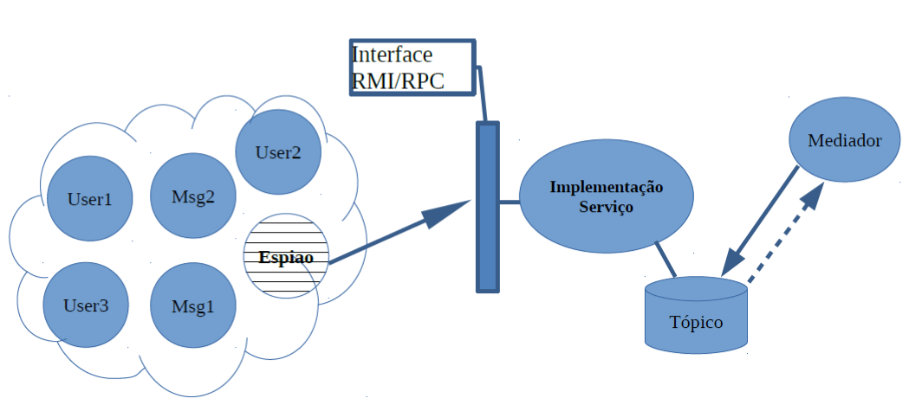

# final-proj-ppd-2023.1
- Facudade: Instituto Federal do Ceará
- Curso: Engenharia de Computação 
- Cadeira: Programação Paralela e Distribuída - 2023.1 
- Prof. Cidcley T. de Souza (*cidcley@ifce.edu.br*)
## Objetivo
Implementar um Sistema de Monitoramento de Mensagens de um Chat 
## Descrição
Deve ser implementado um sistema de monitoramento de mensagens de um 
chat. Tanto os usuários do chat, como as mensagens, devem ser implementados como tuplas em um espaço de tuplas. Deve haver uma tupla especial, denominada espião, que vai  monitorar  todas  as  mensagens  do  chat.  Sempre  que  uma  mensagem  possuir  um determinado grupo de palavras “suspeitas” o espião deve enviar uma mensagem para o mediador  alertando  esse  processo.  Essas  mensagens  devem  ser  depositadas  em  um tópico  em  um  servidor  de  Mensagens  (MOM),  instalado  em  uma  máquina  remota, sendo  que  o  mediador  deve  ser  um  processo  que  registra  interesse  nesse  tópico  e  é avisado  sempre  que  uma  nova  notificação  chegar.  Essa  notificação,  por  sua  vez,  deve ser apresentada na tela do mediador.

A Figura 1 apresenta a arquitetura da aplicação.
##### Obs.: 
- As mensagens do chat devem ser apresentadas na tela de cada usuário. 
- Deve-se garantir que as mensagens sejam extraídas pelos destinatários mas sempre 
passando antes pelo espião. 
- Deve ser possível indicar as palavras suspeitas na interface do espião. 
Figura 1- Arquitetura da Aplicação 
## Critérios de Avaliação 
1. UI do Sistema (0-10) 
2. Chat com Tuplas (0-10) 
3. Comunicação com mediador RMI/RPC (0-10) 
4. Armazenamento MOM (0-10) 
## Data de Entrega: 28/06 (Trabalho Individual)
Deve  ser  enviado  por  email  (*cidcleyifce@gmail.com*)  o  link  do  Google  drive  com  os códigos  fontes  compactados  em  um  único  arquivo  ou  link  do  GitHub.  No  assunto  do email deve conter o texto “Projeto Final”. 
## Observações: 
- TODOS os trabalhos só serão aceitos se apresentados pessoalmente pelo aluno 
na data final de entrega ou, em casos excepcionais, a combinar com o professor. 
- TODOS os trabalhos só serão recebidos por email até às 13h da data de entrega. 
- Não serão aceitos trabalhos enviados de qualquer outra forma. 
- Devem ser entregues TODOS os códigos. 
- Deverá  ser  entregue,  se  a  linguagem  de  programação  permitir,  um  código 
executável (.jar, .exe, etc). 
 ## Commands
- create proto files: python3 -m grpc_tools.protoc --proto_path=. ./snitch.proto --python_out=. --grpc_python_out=.
- run socket server: uvicorn --reload server_chat:app
- run rpc server: python3 server_snitch.py
- start a node:
    - on background: brew services start rabbitmq
    - on foreground: CONF_ENV_FILE="/opt/homebrew/etc/rabbitmq/rabbitmq-env.conf" /opt/homebrew/opt/rabbitmq/sbin/rabbitmq-server
- stopping the server:
    - brew services stop rabbitmq
    - /opt/homebrew/opt/rabbitmq/sbin/rabbitmqctl shutdown